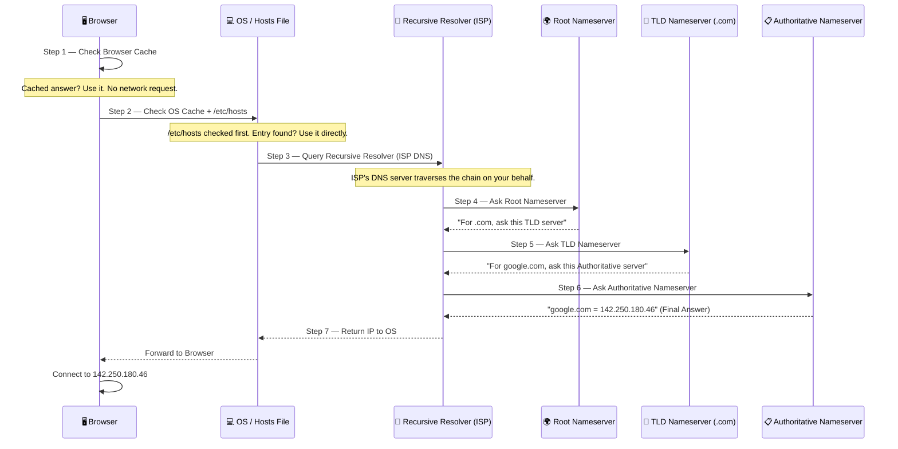
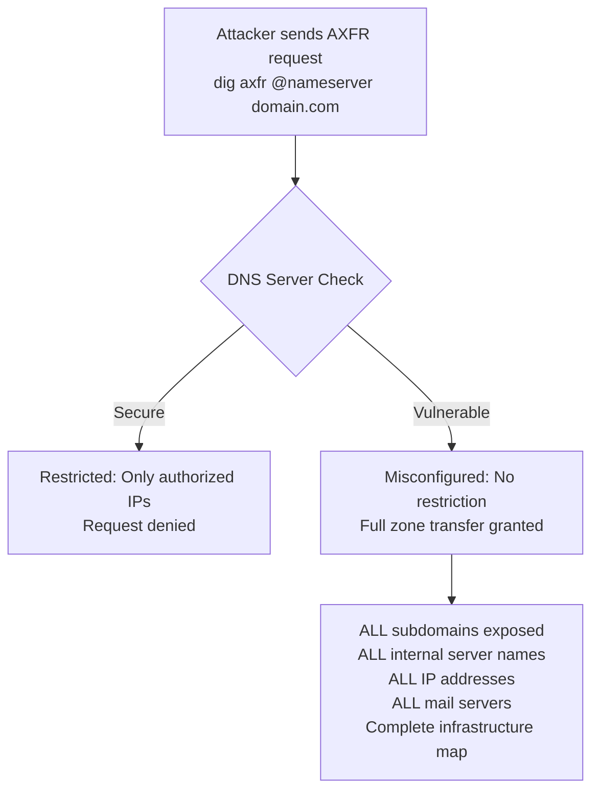
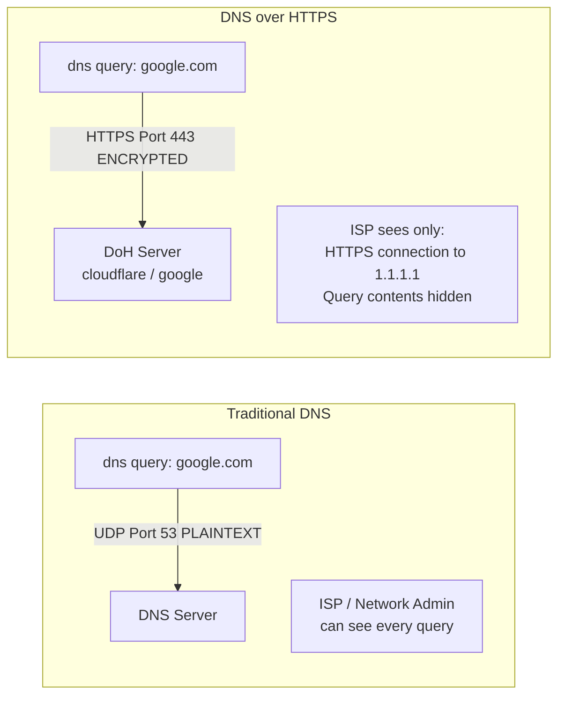
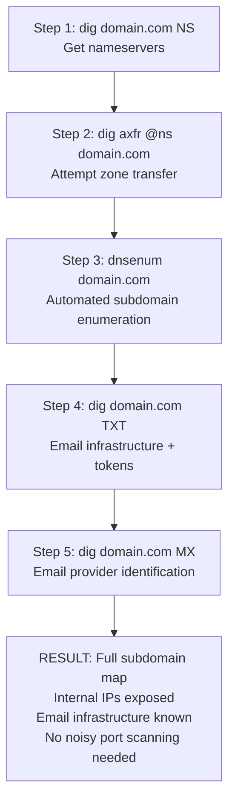

# DNS: Full Resolution Chain, Zone Transfers & DNS over HTTPS


> *"DNS ek translation system hai — aur usi chain mein attacks bhi hote hain."*

A security-focused deep dive into the **DNS Full Resolution Chain**, all **DNS record types**, **Zone Transfers (AXFR)**, and **DNS over HTTPS (DoH)** — with practical Kali Linux labs, a real AXFR exploit on a live vulnerable domain, and a full Purple Team detection workflow.

---

## Table of Contents

- [What is DNS?](#what-is-dns)
- [Full DNS Resolution Chain](#full-dns-resolution-chain)
- [DNS Record Types](#dns-record-types)
- [DNS Practical Part 1](#dns-practical-part-1)
- [Zone Transfers: AXFR](#zone-transfers-axfr)
- [Zone Transfer Practical](#zone-transfer-practical)
- [DNS over HTTPS (DoH)](#dns-over-https-doh)
- [DNS Practical Part 2](#dns-practical-part-2)
- [Purple Team: Full Picture](#purple-team-full-picture)
- [Key Takeaways](#key-takeaways)
- [Additional Resources](#additional-resources)
- [Author](#author)

---

## What is DNS?

**DNS (Domain Name System)** is a translation system. When you type `google.com` in a browser, your computer does not understand that name — it only understands numbers (IP addresses).

DNS translates `google.com` → `142.250.180.46` — the actual IP where the server sits.

**Analogy:** Think of DNS as a phone book. You know the name, the phone book gives you the number. DNS does the same — give it a domain, get back an IP.

```
You type:     google.com
DNS resolves: 142.250.180.46
Browser connects to: 142.250.180.46:443
```

> [!IMPORTANT]
> **Security Context:** The DNS resolution chain has multiple points where an attacker can inject a fake IP. If any point in the chain is compromised, DNS Spoofing (also called DNS Cache Poisoning) occurs — you think you are visiting `google.com` but you are actually on the attacker's machine.

---

## Full DNS Resolution Chain

When you type `google.com` and press Enter, here is what happens step by step — all within milliseconds.



### Step-by-Step Breakdown

| Step | Component | What Happens | Security Risk |
|---|---|---|---|
| **1** | Browser Cache | Checks local DNS cache first | Cache poisoning if injected here |
| **2** | OS Cache + `/etc/hosts` | Checks local hosts file | Malware modifies `/etc/hosts` to redirect legitimate domains to malicious IPs |
| **3** | Recursive Resolver | ISP DNS server traverses chain on your behalf | Rogue resolver returns fake IPs |
| **4** | Root Nameserver | 13 servers globally. Points to correct TLD | DDoS against root = internet disruption |
| **5** | TLD Nameserver | `.com`, `.org`, `.pk` — points to authoritative NS | TLD hijack redirects entire domain |
| **6** | Authoritative Nameserver | Final answer. Actual DNS records stored here | Zone transfer exposes entire database |
| **7** | Response returned | IP travels back up the chain to browser | Man-in-the-Middle at any hop |

> [!WARNING]
> **Hosts File Attack:** Malware commonly modifies `/etc/hosts` (Linux) or `C:\Windows\System32\drivers\etc\hosts` (Windows) so that when you visit a legitimate site, you are silently redirected to a malicious IP — before any DNS query even leaves your machine.
>
> ```bash
> # Always check this file during forensic investigation
> cat /etc/hosts
> ```

---

## DNS Record Types

DNS stores much more than just IP addresses. Every record type is a reconnaissance target.

| Record | Name | Purpose | Security / Recon Value |
|---|---|---|---|
| `A` | Address | Maps domain to IPv4 address | Primary recon target |
| `AAAA` | IPv6 Address | Maps domain to IPv6 address | IPv6 infrastructure discovery |
| `MX` | Mail Exchange | Which servers handle email for this domain | Reveals email provider, mail infrastructure |
| `CNAME` | Canonical Name | Alias — points one domain to another | Subdomain takeover if CNAME points to unclaimed service |
| `NS` | Nameserver | Which servers manage DNS for this domain | Required for zone transfer attempts |
| `TXT` | Text | SPF, DKIM, DMARC records | Bug bounty goldmine — often reveals internal tools, verification tokens |
| `PTR` | Pointer | Reverse lookup — IP to domain name | Identify hostnames from IPs post-pivot |

> [!NOTE]
> **Bug Bounty Tip:** `TXT` records frequently expose misconfigured SPF policies, forgotten verification tokens for third-party services, and internal infrastructure details. Always enumerate TXT records during recon.

---

## DNS Practical Part 1

Run these on your Kali machine. Read every line of output.

### Basic DNS Query

```bash
nslookup google.com
```

| Output Line | Meaning |
|---|---|
| `Server:` | Your current DNS resolver IP |
| `Address:` | google.com's resolved IP address |

---

### Detailed DNS Query with dig

```bash
dig google.com
```

| Output Section | Meaning |
|---|---|
| `ANSWER SECTION` | The actual DNS record returned |
| `TTL` value | Time To Live — how long this answer stays cached (in seconds) |
| `Query time` | How long the resolution took |

---

### Query Specific Record Types

```bash
# Mail exchange records — reveals email provider
dig google.com MX

# Nameservers — required for zone transfer
dig google.com NS

# TXT records — SPF, DKIM, verification tokens
dig google.com TXT
```

---

### Reverse DNS Lookup

```bash
dig -x 8.8.8.8
```

| Flag | Meaning |
|---|---|
| `-x` | Reverse lookup mode — IP to domain |
| Output | `8.8.8.8` resolves to `dns.google` |

> [!NOTE]
> Reverse lookups (`PTR` records) are useful post-exploitation. You have an IP from a network scan — use `-x` to identify the hostname behind it.

---

## Zone Transfers: AXFR

**Zone transfer** is a DNS mechanism for replication. When an organization runs multiple DNS servers, the primary server replicates its database to secondary servers. This process is called **AXFR**.

In a correctly configured environment, AXFR is restricted to authorized secondary servers only.

**If the server is misconfigured — anyone can request a full zone transfer.**



> [!WARNING]
> **What an attacker gets from a successful AXFR:**
> - Every subdomain (`dev.`, `staging.`, `internal.`, `vpn.`, `admin.`)
> - Every internal server name and IP
> - Mail server configuration
> - Complete infrastructure map — without running a single noisy port scan

**AXFR is a classic misconfiguration.** Real-world organizations with misconfigured DNS servers still exist. A single zone transfer gives a pentester the full internal architecture in one request.

---

## Zone Transfer Practical

This practical uses **`zonetransfer.me`** — a deliberately vulnerable domain built specifically for learning AXFR. Zone transfer is intentionally allowed here.

### Step 1 — Get the Nameservers

```bash
dig zonetransfer.me NS
```

Output will show nameservers: `nsztm1.digi.ninja` and `nsztm2.digi.ninja`

These are the servers we will send the AXFR request to.

---

### Step 2 — Execute the Zone Transfer

```bash
dig axfr @nsztm1.digi.ninja zonetransfer.me
```

| Part | Meaning |
|---|---|
| `axfr` | Full zone transfer request |
| `@nsztm1.digi.ninja` | Send the request to this specific nameserver |
| `zonetransfer.me` | The domain whose database we want |

**Expected output:** Every subdomain, every IP, every internal record — all returned in a single response.

---

### Step 3 — Automated DNS Enumeration

```bash
dnsenum zonetransfer.me
```

`dnsenum` automates the entire DNS recon workflow in one command — NS records, MX records, subdomain brute-force, and zone transfer attempt — all at once.

> [!IMPORTANT]
> **Purple Team Detection:** Monitor DNS server logs for AXFR requests. Legitimate zone transfers only come from authorized secondary DNS server IPs. Any AXFR request from an unknown IP = immediate alert.
>
> ```bash
> # Example detection rule concept (Snort/Suricata)
> alert udp any any -> $DNS_SERVERS 53 (msg:"DNS Zone Transfer Attempt AXFR"; content:"|00 FC|"; offset:14;)
> ```

**Real-world fix:** Restrict zone transfers to authorized IPs only in your DNS server configuration.

```bash
# BIND DNS config — restrict AXFR to authorized secondary only
allow-transfer { 192.168.1.2; };
```

---

## DNS over HTTPS (DoH)

**Traditional DNS problem:** DNS queries are sent in **plaintext over UDP port 53**. Anyone who can see your network traffic — your ISP, network admin, or a MITM attacker — can see exactly which domains you are querying.

**DoH solution:** DNS queries are encrypted inside HTTPS and sent over **port 443** — the same port as normal web traffic. No one in the middle can distinguish your DNS queries from regular browsing.



### DoH — Double-Edged Sword

| Side | Detail |
|---|---|
| **Privacy** | ISP and network admins cannot see your DNS queries |
| **Corporate Problem** | Organizations use DNS filtering to block malicious domains. If browsers use DoH and bypass the corporate DNS server, all filtering is skipped. Malware reaches out to C2 domains freely. |
| **Attacker Abuse** | **DNS Tunneling** — C2 traffic is routed through DNS queries encrypted in HTTPS. Corporate proxies and firewalls see only normal HTTPS traffic and let it pass. |

> [!WARNING]
> **DNS Tunneling Detection:** Monitor for:
> - Unusually large DNS response sizes (normal A record = ~50 bytes, tunneling response = much larger)
> - High frequency DNS queries to a single domain
> - Long, random-looking subdomain strings (encoded C2 data)
> - DNS queries to DoH providers from unexpected internal hosts

---

## DNS Practical Part 2

### Query DNS over HTTPS — Cloudflare DoH Endpoint

```bash
curl -s "https://cloudflare-dns.com/dns-query?name=google.com&type=A" \
     -H "accept: application/dns-json"
```

| Part | Meaning |
|---|---|
| `https://cloudflare-dns.com/dns-query` | Cloudflare's DoH endpoint |
| `name=google.com` | Domain to resolve |
| `type=A` | Request A record (IPv4) |
| `-H "accept: application/dns-json"` | Request JSON-formatted response |

**What happens:** The entire DNS query travels encrypted inside HTTPS over port 443. Any intermediate device sees only an HTTPS connection to Cloudflare — not what domain was queried.

---

### Query a Specific DNS Resolver Directly

```bash
dig google.com @1.1.1.1
```

Queries Cloudflare's public DNS resolver (`1.1.1.1`) directly instead of your ISP's resolver.

---

### Check Your Current System DNS Resolver

```bash
cat /etc/resolv.conf
```

The IP listed under `nameserver` is the DNS server handling all queries from your machine.

> [!NOTE]
> During a pentest or red team engagement, checking `/etc/resolv.conf` on a compromised Linux host immediately tells you which internal DNS server the organization uses — a valuable lateral movement and recon target.

---

## Purple Team: Full Picture

Combine DNS recon and detection into one unified workflow.

### Offensive Recon Workflow



### Defensive Detection Controls

| Control | Implementation | Detection Signal |
|---|---|---|
| **Restrict AXFR** | `allow-transfer { authorized-ip; };` in BIND | Any AXFR from unknown IP = alert |
| **DNSSEC** | Sign DNS zones cryptographically | Tampered DNS responses detected and rejected |
| **DNS Log Monitoring** | Centralize DNS query logs to SIEM | Unusual query frequency, large responses, random subdomains |
| **DoH Policy** | Block DoH providers at corporate firewall | Enforce internal DNS filtering cannot be bypassed |
| **Hosts File Integrity** | Monitor `/etc/hosts` with file integrity tool | Any modification = malware indicator |

---

## Key Takeaways

> [!IMPORTANT]
> **DNS is not just a utility — it is an attack surface.** Every hop in the resolution chain is a potential injection point. Every record type is a recon target. Zone transfers are an entire infrastructure map waiting to be downloaded.

| # | Takeaway |
|---|---|
| **01** | **DNS = translation system.** Domain name → IP address. Resolution happens in a chain: Browser Cache → OS → Recursive Resolver → Root → TLD → Authoritative. |
| **02** | **Hosts file is checked before DNS.** Malware modifies `/etc/hosts` to silently redirect legitimate domains to malicious IPs. Always check it during incident response. |
| **03** | **DNS record types = recon goldmine.** A, AAAA, MX, NS, CNAME, TXT, PTR — each reveals different infrastructure details. TXT records especially contain sensitive information. |
| **04** | **Zone Transfer (AXFR) = misconfiguration.** One request dumps every subdomain, IP, and server name in the organization. Restrict AXFR to authorized IPs only. |
| **05** | **DoH = encrypted DNS over port 443.** Privacy benefit: ISP cannot see queries. Security risk: bypasses corporate DNS filtering and enables DNS tunneling for C2 traffic. |

---

## Additional Resources

- 📺 **Watch the Tutorial:** [DNS Deep Dive — Full Walkthrough in Urdu/Hindi](https://www.youtube.com/@MuhammadAqibTayyab)
- 🌐 **Zone Transfer Practice Domain:** [zonetransfer.me](https://zonetransfer.me)
- 🛡️ **Previous Module:** [Routing Tables & NAT](https://github.com/AqibTayyab/Routing-Tables-NAT)
- 🔌 **Previous Module:** [IP Addressing, Subnetting & CIDR](https://github.com/AqibTayyab/IP-Addressing-Subnetting-CIDR)
- 🌐 **Previous Module:** [TCP & UDP: Protocol Deep-Dive](https://github.com/AqibTayyab/TCP-UDP-Protocol-Deep-Dive)
- 🗺️ **Series Start:** [OSI Model: Network Architecture & Security Deep-Dive](https://github.com/AqibTayyab/OSI-Model-Security-Deep-Dive)
- 💼 **Connect:** [LinkedIn: Muhammad Aqib Tayyab](https://www.linkedin.com/in/muhammad-aqib-tayyab-ethical-hacker/)

---

## Author

**Muhammad Aqib Tayyab** — AppSec & Purple Team Student | Certified Ethical Hacker | Bug Bounty Hunter

I am an undergraduate **BS-IT student at NUML, Pakistan**, pursuing a *"Learning in Public"* philosophy to document my technical cybersecurity journey and build high-quality, accessible resources for the community.

[](https://www.linkedin.com/in/muhammad-aqib-tayyab-ethical-hacker/)
[](https://www.youtube.com/@MuhammadAqibTayyab)
[](https://github.com/AqibTayyab)

---

> *Part of the **Phase 1 Networking** series — providing practical cybersecurity tutorials for the Urdu/Hindi-speaking community.*

`#DNS` `#ZoneTransfer` `#AXFR` `#DNSoverHTTPS` `#NetworkSecurity` `#Cybersecurity` `#AppSec` `#PurpleTeam` `#EthicalHacking` `#LearningInPublic` `#Pakistan` `#NUML`
